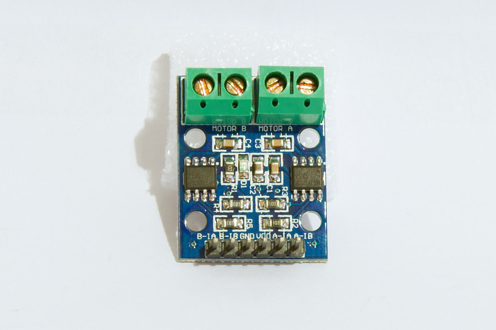

# arduino-police-car
Arduino sketch made as a school project for programming in Arduino. This library is controlling Arduino robotic car.

Here's what it looks like:

Here are the schematics:

Unfortunately the schematics for car have different H-bridge, than we used in this project. The correct one should be: `L9110`. However I did not find Fritzing part for this particular one.

This is what the correct H-Bridge looks like:

So the corrections have to ba made in order for motors to work correctly:

1. The YELLOW wire now connected to IN1 should be connected to A1-B
2. The GREEN wire now connected to IN2 should be connected to A1-A
3. The ORANGE wire now connected to IN3 should be connected to B1-B
4. The BLUE wire now connected to IN4 should be connected to - B1-A

If the motors polarity isn't working correctly for you, try switching the wires controlloing the motors as well.

If someone has the fritzing part for L9110 H-bridge, pull requests are welcome.
